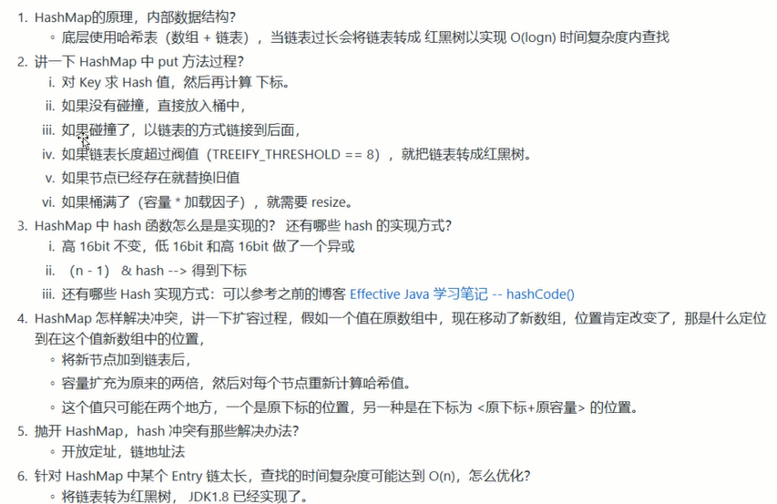
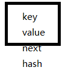
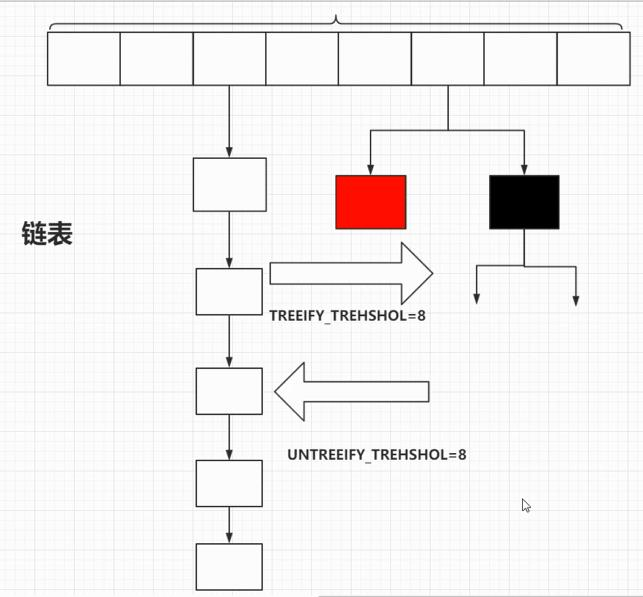

# hashmap-sourcecode-analysis


#### hasmap的面试题





> hashmap的底层数据结构是数据加链表


> 链表转红黑树

###  

### 数组

> 查询效率高  增删效率低


> 存放数组元素


```java
transient Node<K,V>[] table
```


> 数组的初始值


> 数组的长度必须是2^n,只有2^n -1  才能保证底位才是1，才能保证put时候获取的下标足够的分散

```java
static final int DEFAULT_INITIAL_CAPACITY = 1 << 4; // aka 16
```


> 数组的最大值


```java
static final int MAXIMUM_CAPACITY = 1 << 30;
```


> 扩容的条件


```java
static final float DEFAULT_LOAD_FACTOR = 0.75f;
```


> 记录数组的使用情况
>
> 每次数组有变化的时候，都用对size进行操作


```java
transient int size;
```


### 链表


> 查询效率低  增删效率高


> 链表的图例


```java
   static class Node<K,V> implements Map.Entry<K,V> {
        final int hash;
        final K key;
        V value;
        Node<K,V> next;
```







> 链表的长度 超过将会转为红黑树


```java
static final int TREEIFY_THRESHOLD = 8;
```


> 红黑树恢复链表的条件


```java
static final int UNTREEIFY_THRESHOLD = 6;
```


### 红黑树

```java
    static final class TreeNode<K,V> extends LinkedHashMap.Entry<K,V> {
        TreeNode<K,V> parent;  // red-black tree links
        TreeNode<K,V> left;
        TreeNode<K,V> right;
        TreeNode<K,V> prev;    // needed to unlink next upon deletion
        boolean red;
      ...
    }
```


## 方法分析


### put

> 思考：
>
> 方式数组
>
> - 放入数组下标（怎么求下标并且不能超过数组的长度）


```java
   public V put(K key, V value) {
        return putVal(hash(key), key, value, false, true);
    }
```


### hash

```java
//将高16位 异或 低16位
static final int hash(Object key) {
  int h;
  return (key == null) ? 0 : (h = key.hashCode()) ^ (h >>> 16);
}

```


###  resize

> 初始化  扩容

```java
final Node<K,V>[] resize() {
    //将table赋值给oldTab
    Node<K,V>[] oldTab = table;
    int oldCap = (oldTab == null) ? 0 : oldTab.length;
  	//将阈值 赋值 给oldThr
    int oldThr = threshold;
    int newCap, newThr = 0;
    if (oldCap > 0) {
        if (oldCap >= MAXIMUM_CAPACITY) {
            threshold = Integer.MAX_VALUE;
            return oldTab;
        }
       // 进行两部扩容
        else if ((newCap = oldCap << 1) < MAXIMUM_CAPACITY &&
                 oldCap >= DEFAULT_INITIAL_CAPACITY)
            newThr = oldThr << 1; 
    }
    else if (oldThr > 0) 
        newCap = oldThr;
    else {      
      	//初始化数组长度
        newCap = DEFAULT_INITIAL_CAPACITY;
       	//初始化阈值
        newThr = (int)(DEFAULT_LOAD_FACTOR * DEFAULT_INITIAL_CAPACITY);
    }
    if (newThr == 0) {
        float ft = (float)newCap * loadFactor;
        newThr = (newCap < MAXIMUM_CAPACITY && ft < (float)MAXIMUM_CAPACITY ?
                  (int)ft : Integer.MAX_VALUE);
    }
    //将阈值赋值给threshold
    threshold = newThr;
    @SuppressWarnings({"rawtypes","unchecked"})
  		//创建node数组
        Node<K,V>[] newTab = (Node<K,V>[])new Node[newCap];
    table = newTab;
  
  //将老数组移位  1  是数组  2 是链表  3 是红黑树
    if (oldTab != null) {
        for (int j = 0; j < oldCap; ++j) {
            Node<K,V> e;
            if ((e = oldTab[j]) != null) {
                oldTab[j] = null;
               //是数组
                if (e.next == null)
                    newTab[e.hash & (newCap - 1)] = e;
               //红黑树
                else if (e instanceof TreeNode)
                    ((TreeNode<K,V>)e).split(this, newTab, j, oldCap);
                else { 
                    Node<K,V> loHead = null, loTail = null;
                    Node<K,V> hiHead = null, hiTail = null;
                    Node<K,V> next;
                    do {
                        next = e.next;
                        if ((e.hash & oldCap) == 0) {
                            if (loTail == null)
                                loHead = e;
                            else
                                loTail.next = e;
                            loTail = e;
                        }
                        else {
                            if (hiTail == null)
                                hiHead = e;
                            else
                                hiTail.next = e;
                            hiTail = e;
                        }
                    } while ((e = next) != null);
                    if (loTail != null) {
                        loTail.next = null;
                        newTab[j] = loHead;
                    }
                    if (hiTail != null) {
                        hiTail.next = null;
                        newTab[j + oldCap] = hiHead;
                    }
                }
            }
        }
    }
    return newTab;
}
```


### putVal


>  (n - 1) & hash  ----> 保证下标尽可能的分散
>
> - 从数组长度入手
> - 从hash值入手
>
> 
>
> 

```java
final V putVal(int hash, K key, V value, boolean onlyIfAbsent,
                   boolean evict) {
        Node<K,V>[] tab; Node<K,V> p; int n, i;
  		//数组为空 初始化数组
        if ((tab = table) == null || (n = tab.length) == 0)
           //将初始后化数组的长度赋值给n
            n = (tab = resize()).length;
  			//如果值为空,直接复制
    		// tab[i = (n - 1) & hash]  获取下标，效率高，保证分散
        if ((p = tab[i = (n - 1) & hash]) == null)
            tab[i] = newNode(hash, key, value, null);
        else {
            Node<K,V> e; K k;
            //如果值相等，直接替换
            if (p.hash == hash &&
                ((k = p.key) == key || (key != null && key.equals(k))))
                e = p;
          	//是否是红黑树
            else if (p instanceof TreeNode) //红黑树
                e = ((TreeNode<K,V>)p).putTreeVal(this, tab, hash, key, value);
            else { //链表
               	//循环遍历当前链表的元素
                for (int binCount = 0; ; ++binCount) {
                   	//如果当前元素的下一个元素为空 将待插入的元素放入下一个元素，
                    if ((e = p.next) == null) {
                        p.next = newNode(hash, key, value, null);	
                      	//将链表转化为红黑树
                        if (binCount >= TREEIFY_THRESHOLD - 1) // -1 for 1st
                            treeifyBin(tab, hash);
                        break;
                    }
                   //如果待插入的元素等于链表上的元素，直接替换
                    if (e.hash == hash &&
                        ((k = e.key) == key || (key != null && key.equals(k))))
                        break;
                    p = e;
                }
            }
          //如果相等的话，覆盖并且返回旧值
            if (e != null) { // existing mapping for key
                V oldValue = e.value;
                if (!onlyIfAbsent || oldValue == null)
                    e.value = value;
                afterNodeAccess(e);
                return oldValue;
            }
        }
        ++modCount;
  		//超过阈值 进行扩容
        if (++size > threshold)
            resize();
        afterNodeInsertion(evict);
        return null;
    }

```

